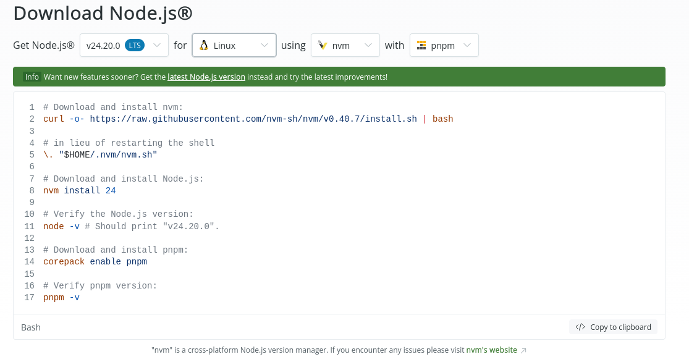
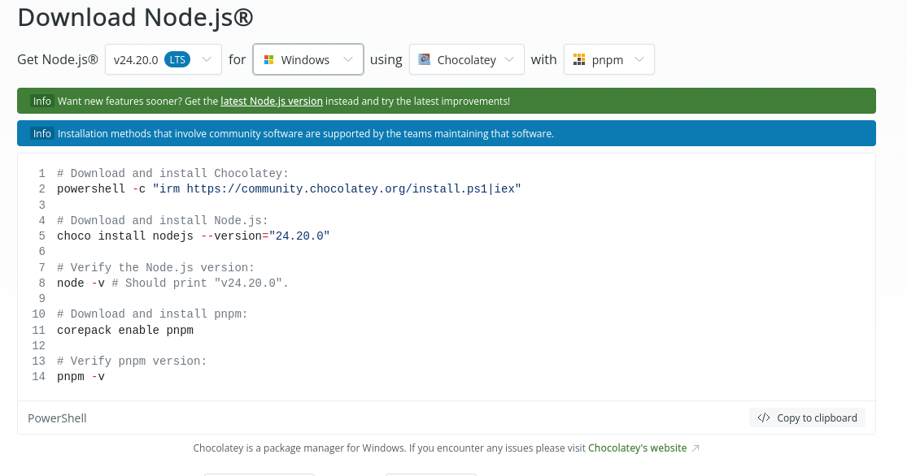

# Contributing to ReqCraft

Thank you very much to want to contribute to this project. The objective with the code is easy: separated responsabilities between "frontend" and "backend" and clean code.

## Stack

This project is develop with [Tauri](https://tauri.app/) in base with PNPM as dependency manager.
In "frontend" side, we have Vue.Js with Typescript to make all the user interface.
In "backend" side, we have Rust as main language.

## Project structure

```text
/src -> Vue + Vite app. Contains all files of Typescript, CSS and Vue.JS to construct all UI.

/src-tauri -> Contains all files from Rust to make all system operations like save, edit or delete files; manage workspaces in file systems or create request.
```

## Run project in develop

### Rust

First, you need to install [Rust](https://www.rust-lang.org/tools/install) in your computer. You can install it with a command in your terminal.

```bash
# On Linux and MacOS
curl --proto '=https' --tlsv1.2 https://sh.rustup.rs -sSf | sh

# On Windows
winget install --id Rustlang.Rustup
```

### NodeJs (PNPM)

This project uses VueJs and Typescript, then, you must have NodeJs in your system and PNPM.
You can install NodeJs and PNPM following this options in [installation](https://nodejs.org/en/download) page:

<div align="center">
  
  <strong>Linux and MacOs installation</strong>
</div>

<div align="center">
  
  <strong>Windows installation</strong>
</div>

You need to install Nodejs 24 and PNPM 11 because this project use these versions of the tools.

### System dependencies (only on Linux)

To ensure you can develop in any Linux distribution, you need to install some dependencies. Every Linux distributions needs a different command to install it, so, you can check your distributions command to install tool in [this](https://tauri.app/start/prerequisites/#linux) place.

### Init project in development environment

With this, you can see the project in action with this command:

```bash
# Access to project folder
pnpm tauri dev
```

## Requests

There are some considerations to make your requests in this project.

### Branches

There are 3 important branches:

1. **main**: this branch is the most important branch. It has the stable changes made from develop.

2. **develop**: this branch contains all newer changes, but this changes is not available to all users because the changes is not stable.

3. **branches with tag version**: with this branch, we can organize changes across all versions and working in a single place. You must to create a new branch from this branches to make new changes.

### Code

You need to follow the responsability of each side of the project. How we describe, this project is divided in _frontend_ and _backend_ sides.

In a side, we have ViteJS with Typescript to create the UI and make it beautiful. This is only dedicated to create the UI, not more.

In other side, we have Rust and Tauri API to manage things like system calls, file management and thing that we need more control in the system user. This is created using **Tauri commands** to connect the functionalities from system user and _frontend_ side.

To "clean" the code, you need to run the command `pnpm format:check` to check if the code is correct and realize all the **eslint** rules. You can run `pnpm format` to fix some warnings or problems that eslint found.

### PR

You need to follow a template to complement your PR. With the [template](docs/templates/pr-template.md) you can complement the PR with usefull information to all colaborators of this project. Then, write a short but usefull title to identify faster what changes you create and follow and check it.

If your PR is a security fix, please use the [security's](docs/templates/pr-security.md) and follow the [section](#security) of security.

### Security

You can find information about how to report a security issue in [SECURITY.md](SECURITY.md) file.
